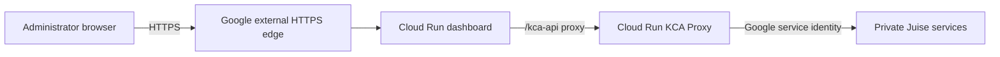

# Google Cloud Deployment

## Goal

Move the Juise Rider Admin Dashboard from Replit to Google Cloud Run while
keeping Replit online until the Google-hosted QA deployment is proven. The
dashboard remains a public web interface, but administrator authorization is
still enforced by KCA and downstream services.



The dashboard never connects directly to Global Auth, Nebula, databases, or
Secret Manager. The frontend uses `/kca-api`; nginx selects the appropriate QA
or production KCA origin from `KCA_PROXY_TARGET` at container startup.

## Environment Map

| Setting | QA | Production |
| --- | --- | --- |
| Git branch | `qa` | `prod` |
| GitHub environment | `qa` | `prod` |
| GCP project | `juise-fed-pre-run-154427` | `juise-fed-prod-run-154427` |
| Cloud Run service | `juise-rider-admin-dashboard` | `juise-rider-admin-dashboard` |
| Intended hostname | `qa-dashboard.juisemobility.com` | `dashboard.juisemobility.com` |
| Deployment trigger | Push or manual | Manual with approved change reference |
| Minimum instances | 0 | 0 initially |

Production deployment is deliberately manual. GitHub environment protection
should require a reviewer before the production job can run.

## One-Time Bootstrap

Infrastructure lives in
`/home/melody/Developer/software/kuhmute/infrastructure-gcp`.

1. Apply `environments/preprod` and `environments/prod` so the dashboard GitHub
   repository can impersonate each environment's deployer service account.
2. Build and push an initial dashboard image to each Artifact Registry.
3. Copy each `terraform.tfvars.example` to the ignored `terraform.tfvars`, set
   the immutable image digest, and set `deploy_service = true`:
   - `services/admin-dashboard-preprod`
   - `services/admin-dashboard-prod`
4. Apply the QA service first and verify its generated Cloud Run URL.
5. Apply `services/qa-public-domains` to add the QA load-balancer route and
   managed certificate.
6. Configure the GitHub `qa` and `prod` environments with
   `GCP_WORKLOAD_IDENTITY_PROVIDER` and `GCP_DEPLOY_SERVICE_ACCOUNT` secrets.

No service-account key files are permitted. GitHub uses short-lived Workload
Identity Federation credentials.

## Releases

### QA

Push reviewed changes to `qa`, or select the `qa` branch when manually running
`Deploy QA to Google Cloud`. The workflow compiles the application, creates an
immutable image, deploys it by digest, and verifies `/health/live`.

### Production

Merge the approved release into `prod`. Run `Deploy Production to Google
Cloud` from the `prod` branch, enter the approved ticket/change reference, and
approve the protected GitHub environment. The workflow records the image,
revision, URL, and change reference in the job summary.

## DNS Cutover

Do not change DNS merely because Terraform applied successfully.

1. Verify the generated QA Cloud Run URL loads and can sign in.
2. Verify representative read and write operations through `/kca-api`.
3. Apply the QA load-balancer route and wait for its certificate to become
   `ACTIVE`.
4. Lower DNS TTL, then point `qa-dashboard.juisemobility.com` to the Google
   load-balancer IP.
5. Observe logs and error rates before changing production.
6. Repeat under an approved production change.

Replit is the rollback target during migration. If validation fails, restore
the prior DNS value; do not delete the Replit deployment until the production
observation period is complete.

## Verification

```bash
gcloud run services describe juise-rider-admin-dashboard \
  --project juise-fed-pre-run-154427 \
  --region us-east5 \
  --format='yaml(status.url,status.latestReadyRevisionName)'

curl -fsS "$(gcloud run services describe juise-rider-admin-dashboard \
  --project juise-fed-pre-run-154427 \
  --region us-east5 \
  --format='value(status.url)')/health/live"
```

Evidence to retain for each release:

- GitHub workflow run and approver
- Git commit and immutable Artifact Registry digest
- Cloud Run revision and configuration export
- Health check and representative API test
- Terraform plan/apply output
- DNS change and rollback record, when applicable

## Known Quality Baseline

`npm run build` passes. The repository currently has pre-existing ESLint and
Prettier findings outside the deployment files. They should be cleared in a
separate reviewed change before those checks become blocking release gates.
